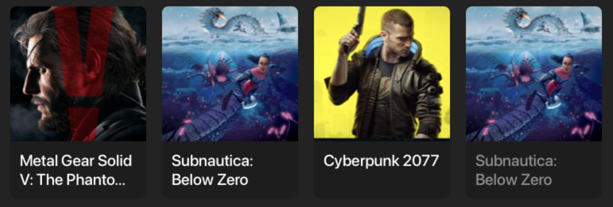

<h1 align="center">Games</h1>

<p align="center">
  <a href="https://opensource.org/licenses/Apache-2.0"></a>
</p>

<p align="center">  
This is a basic Android application that shows list of games(https://rawg.io/apidocs) and their details, based on mvvm architecture.

</p>

<p align="center">
  
</p>


## Tech stack
* ✅ Clean Architecture
* ✅ MVVM
* ✅ Kotlin Flow
* ✅ Kotlin Coroutines
* ✅ Navigation Component
* ✅ Safe-Args
* ✅ Dagger Hilt
* ✅ Livedata
* ✅ ViewModel
* ✅ Navigation Component
* ✅ Retrofit
* ✅ Paging 3
* ✅ View Binding
* ✅ Lifecycle


# License
```xml
Designed and developed by 2022 Utku Kalkanlı

Licensed under the Apache License, Version 2.0 (the "License");
you may not use this file except in compliance with the License.
You may obtain a copy of the License at

   http://www.apache.org/licenses/LICENSE-2.0

Unless required by applicable law or agreed to in writing, software
distributed under the License is distributed on an "AS IS" BASIS,
WITHOUT WARRANTIES OR CONDITIONS OF ANY KIND, either express or implied.
See the License for the specific language governing permissions and
limitations under the License.
```
